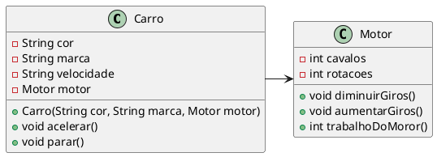
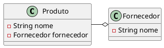
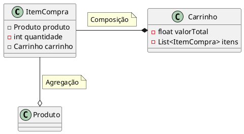

# Associações
- Forma como uma classe se relaciona com outra classe
- Uma classe pode conter atributos que geram instâncias de outra classe
    - Uma classe pode conter outra classe como atributo
    - Quando isto ocorre dizemos que uma classe possui outra classe associada a ela

    
<figure>

<figcaption>Exemplo de Associação.</figcaption>
</figure>

## Agregação
- A classe contida não é instanciada no escopo da classe principal
    - Não depende da principal para existir 
    - Normalmente é passada por parâmetro

- Agregação é uma associação em que um objeto é parte de outro, de tal forma que a parte pode existir sem o todo.
- Em mais baixo nível, uma agregação consiste de um objeto contendo referências para outros objetos, de tal forma que o primeiro seja o todo, e que os objetos referenciados sejam as partes do todo.

<figure>

<figcaption>Exemplo de Agregação.</figcaption>
</figure>

## Composição
- A classe contida é instanciada pela classe principal 
- Quando uma instancia da classe principal é retirada da memória, as instancias das outras classes também são.
- O todo contém as partes (e não referências para as partes). Quando o todo desaparece, todas as partes também desaparecem.

<figure>

<figcaption>Exemplo de Composição.</figcaption>
</figure>

## Exercícios

- [Exercício DVD](exercicios/05_exercicio_modelagem_dvd.md)
- [Exercício Prédio](exercicios/06_exercicio_predio_OO.md)
- [Exercício Computador](exercicios/07_exercicio_modelagem_computador.md)
  
