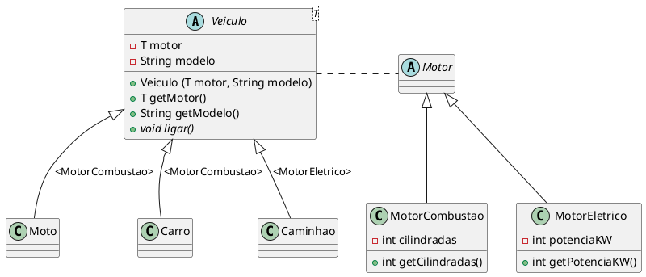

# Tipificação Forte com Generics

[^jai_generics_2014]

## Tipificação Forte

Java é uma linguagem de tipificação forte (ou fortemente tipada), o que significa que o tipo de uma variável é verificado em tempo de compilação e não pode ser alterado dinamicamente durante a execução do programa. Isso implica que o compilador Java verifica se as operações realizadas com uma variável são compatíveis com seu tipo declarado. 

Por exemplo, você não pode atribuir uma String a uma variável do tipo int.

@[code](./code/generics/tiposIncompativeis.java)


A tipificação forte evita erros comuns, como tentar acessar métodos ou propriedades que não existem para um determinado tipo, reduzindo bugs e facilitando a depuração.

Ao declarar explicitamente os tipos das variáveis, o código se torna mais legível e compreensível, pois fica claro quais dados estão sendo manipulados.

No entanto, a tipificação forte pode exigir mais esforço do desenvolvedor, já que é necessário garantir que os tipos estejam sempre corretos. É aqui que os generics entram em cena, oferecendo flexibilidade sem sacrificar a segurança.

### Explicitando Subtipo

Considerando o modelo a seguir:

```plantuml
abstract Veiculo{
  Motor motor
  Veiculo (Motor motor)
  Motor getMotor()
}

class Moto extends Veiculo
class Carro extends Veiculo
class Caminhao extends Veiculo

abstract Motor

class MotorCombustao extends Motor{
  - int cilindradas
  + int getCilindradas()
}

class MotorEletrico extends Motor{
  - int potenciaKW
  + int getPotenciaKW()
}

Veiculo . Motor

```

Pela definição da classe `Veiculo`, o atributo `motor` é do tipo `Motor`. Isso significa que qualquer instância de `Veiculo` (`Carro`, `Moto` ou `Caminhao`) pode ter um motor de qualquer tipo que herde de `Motor`, como `MotorCombustao` ou `MotorEletrico`.

Caso a classe filha de Veiculo precise de um tipo específico de motor, como `MotorCombustao`, o código ficaria assim:

```java
public class Carro extends Veiculo {
    public Carro(MotorCombustao motor){
      super(motor);
    }
}
```

Com isso, o construtor de `Carro` aceita apenas um `MotorCombustao`, garantindo que o tipo de motor seja consistente com o tipo de veículo.

Apesar da instancia de um `Carro` sempre ter como instancia de motor um `MotorCombustao`, o `getMotor` vai retornar um `Motor`, sendo necessário fazer um cast para `MotorCombustao` quando for necessário acessar métodos específicos desse tipo de motor.

```java
Carro carro = new Carro(new MotorCombustao());
Motor motor = carro.getMotor(); // Retorna Motor, mas é um MotorCombustao
MotorCombustao motorCombustao = (MotorCombustao) motor; // Cast
System.out.println("Cilindradas: " + motorCombustao.getCilindradas());
```

## Generics

Os generics foram introduzidos no Java 5 para permitir que classes, interfaces e métodos operem com tipos parametrizados. Eles são uma forma de criar código reutilizável e seguro, evitando a necessidade de casts explícitos, e erros de tipo, em tempo de execução.

Antes dos generics, era comum usar Object para criar coleções ou classes que pudessem armazenar qualquer tipo de dado. No entanto, isso exigia casts explícitos e podia levar a erros em tempo de execução.


@[code](./code/generics/ExemploObject.java)

<codapi-snippet sandbox="java" editor="basic"></codapi-snippet>

Com generics, podemos criar coleções ou classes que trabalham com tipos específicos, eliminando a necessidade de casts e garantindo segurança de tipo em tempo de compilação.

@[code](./code/generics/ExemploGenerics.java)

<codapi-snippet sandbox="java" editor="basic"></codapi-snippet>

### Comparativo


| Aspecto                        | Uso de `Objects`                             | Uso de Generics                             |
| ------------------------------ | ------------------------------------------ | ------------------------------------------- |
| **Segurança de Tipo**          | Não há verificação em tempo de compilação. | Verificação em tempo de compilação.         |
| **Casts**                      | Necessários e propensos a erros.           | Não são necessários.                        |
| **Flexibilidade**              | Aceita qualquer tipo, mas sem segurança.   | Aceita tipos específicos com segurança.     |
| **Erros em Tempo de Execução** | Comuns (ex: `ClassCastException`).           | Raros (erros são detectados em compilação). |


### Mais exemplos

@[code](./code/generics/GenericsTest.java)


<codapi-snippet sandbox="java" editor="basic"></codapi-snippet>


#### Exemplo de classe com Generics com dois parâmetros:

@[code](./code/generics/GenericsTest2.java)

<codapi-snippet sandbox="java" editor="basic"></codapi-snippet>

## Herança com Generics

A combinação de herança e generics em Java permite criar hierarquias de classes que são flexíveis e seguras em termos de tipos. 

Considere o cenário de um sistema de gerenciamento de veículos, onde devem ser criados diferentes tipos de veículos apresentado no item anterior.

Podemos usar generics para definir na classe base `Veiculo` um tipo genérico `T` que representa o tipo de motor do veículo. As subclasses podem então especificar o tipo de motor que usam.



As subclasses de Veiculo que especificam o tipo de motor.

- `Carro`: Usa um `MotorCombustao`.
- `Moto`: Usa um `MotorCombustao`.
- `CaminhaoEletrico`: Usa um `MotorEletrico`.


@[code](./code/generics/extends/Veiculo.java)

A classe `Veiculo` é uma classe que aceita um tipo `T` genérico para o motor. Ela define comportamentos comuns para todos os veículos.


@[code](./code/generics/extends/MotorCombustao.java)

@[code](./code/generics/extends/MotorEletrico.java)


@[code](./code/generics/Carro.java)
@[code](./code/generics/Moto.java)
@[code](./code/generics/CaminhaoEletrico.java)


Testando a Hierarquia

@[code](./code/generics/TestaVeiculos.java)

```console
Carro Sedan com Motor Combustão (2000cc) está ligado.
Moto Esportiva com Motor Combustão (600cc) está ligada.
Caminhão Elétrico Carga Pesada com Motor Elétrico (300kW) está ligado.
```

A grande vantagem dessa abordagem é que ao chamar o método `getMotor`, o tipo retornado é específico para cada veículo, eliminando a necessidade de casts e aumentando a segurança do tipo.

@[code](./code/generics/extends/TestaVeiculos.java)


## Restringir o tipo genérico `T`

O uso de `T extends` em generics permite restringir o tipo genérico `T` a uma classe ou interface específica, garantindo que apenas subtipos dessa classe ou interface possam ser usados. Isso é útil para impor limites aos tipos aceitos e acessar métodos ou propriedades específicas da classe ou interface.

Imagine que no exemplo anterior, alguém defina um novo veículo como o exibido abaixo:

@[code](./code/generics/Pop.java)

Faz sentido ter um veículo como `Carro` passar como tipo T um `Interger`?

É possível fazer uma restrição para que todos os tipos definidos para o genérico sejam filhos de `Motor`, por exemplo.

@[code](./code/generics/extends/Veiculo.java)
@[code](./code/generics/Pop.java)

Com essa restrição, a classe `Pop` não poderia ser compilada já que `Integer` não herda de `Motor`


### Outro Exemplo


@[code](./code/generics/FormaGeometrica.java)
@[code](./code/generics/Circulo.java)
@[code](./code/generics/Retangulo.java)
@[code](./code/generics/CalculadoraArea.java)
@[code](./code/generics/TestaCalculadoraArea.java)

```console
Área do círculo: 78.53981633974483
Área do retângulo: 24.0
```

::: warning Exemplo de Erro de Tipo

Se tentarmos usar um tipo que não implementa `FormaGeometrica`, o compilador gerará um erro:

```java
// Erro de compilação: String não implementa FormaGeometrica
CalculadoraArea<String> calculadoraInvalida = new CalculadoraArea<>("Texto");
```

:::

## Referências

<!-- @include: ../../includes/bib.md -->


