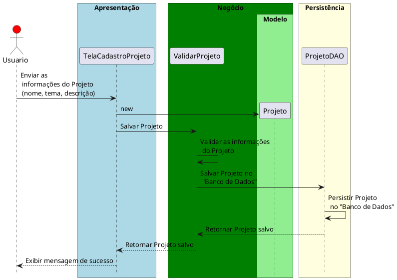

# Diagrama de Sequência

Exemplo de Diagrama de Sequência para o caso de uso "Cadastrar Projeto":

```plantuml{kroki=true}
@startuml
hide footbox
actor Usuario #red
box "Apresentação" #lightblue  
    participant TelaCadastroProjeto
end box
!pragma teoz true
box "Negócio" #green
participant ValidarProjeto
box "Modelo" #lightgreen
participant Projeto
end box
end box
box "Persistência" #lightyellow
    participant ProjetoDAO
end box

Usuario -> TelaCadastroProjeto: Enviar as \n informações do Projeto \n (nome, tema, descrição)
create Projeto
TelaCadastroProjeto -> Projeto: new


TelaCadastroProjeto -> ValidarProjeto: Salvar Projeto
ValidarProjeto -> ValidarProjeto: Validar as informações \n do Projeto
ValidarProjeto -> ProjetoDAO: Salvar Projeto no \n "Banco de Dados"
ProjetoDAO -> ProjetoDAO: Persistir Projeto \n no "Banco de Dados"
ProjetoDAO --> ValidarProjeto : Retornar Projeto salvo
ValidarProjeto --> TelaCadastroProjeto: Retornar Projeto salvo
TelaCadastroProjeto --> Usuario: Exibir mensagem de sucesso 

@enduml

```
