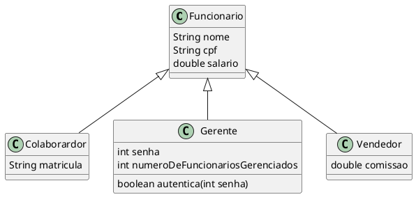

```plantuml
@startuml

class Funcionario{    
    String nome
    String cpf
    double salario

}
class Colaborardor extends Funcionario {
    String matricula
}

class Gerente extends Funcionario {
    int senha
    int numeroDeFuncionariosGerenciados
    boolean autentica(int senha)
}

class Vendedor extends Funcionario {
    double comissao
}
@enduml
```