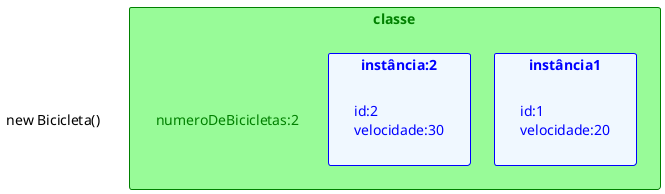

# Membros de classes

[^Takenami]


Ao instanciar um objeto utilizando o operador `new`, a linguagem Java realiza a alocação de memória necessária para armazenar os valores dos atributos desse objeto. Cada instância possui sua própria cópia das variáveis de instância, que correspondem aos atributos definidos na estrutura da classe. Tais atributos são denominados **membros de instância** ou **variáveis de instância**.

Entretanto, em determinadas situações, torna-se necessário definir variáveis ou métodos que não estejam vinculados a uma instância específica, mas sim à própria classe. Esses elementos são conhecidos como **membros de classe** ou **variáveis de classe**.

Para declarar membros de classe, emprega-se o modificador `static`. O acesso a esses membros pode ser realizado diretamente por meio do nome da classe, sem a necessidade de criação de objetos (instâncias). Embora seja possível acessá-los por meio de uma instância, a abordagem recomendada e mais utilizada é o acesso direto pela classe, evidenciando seu caráter de contexto de classe.

## Atributos de classe

Quando definimos atributos ao escrever o código de uma classe, esses atributos são naturalmente definidos como atributos de instância. Isso significa que cada objeto criado a partir dessa classe terá sua própria cópia desses atributos, armazenados em locais distintos na memória.

<figure>

<!-- @include: ./diagramas/objetos/EspecificacaoConta.plantuml -->

<figcaption> Atributos de Instância.</figcaption>
</figure>

Ao utilizar a palavra-chave `static`, definimos atributos que pertencem à classe como um todo, e não a uma instância específica. Esses atributos não estão no contexto de um objeto, mas sim no contexto da classe. Por isso a definição de **atributos de classe**.


```java{13}
public class Main {
    public static void main (String arg[]) {
      Bicicleta bicicleta1 = new Bicicleta(20);
      Bicicleta bicicleta2 = new Bicicleta(30);
      System.out.println(bicicleta1);
      System.out.println(bicicleta2);
    }
}

class Bicicleta {
  private int velocidade;
  private int id;
  private static int numeroDeBicicletas = 0;
  public Bicicleta(int velocidade){
    this.velocidade = velocidade;
    this.id = ++numeroDeBicicletas;
  }
  public int getID() {
    return id;
  }
  public toString toString() {
    return "Bicicleta{" +
            "id=" + id +
            ", velocidade=" + velocidade +
            '}';
  }
}

```
<codapi-snippet sandbox="java" editor="basic"></codapi-snippet>

Quando o código acima é executado, o java cria dois objetos da classe Bicicleta, cada um com seus próprios atributos de instância, como velocidade e id. No entanto, ambos "compartilham" o atributo de classe `numeroDeBicicletas`, que é incrementado a cada nova instância criada.

Os objetos da classe Bicicleta podem acessar o atributo de classe `numeroDeBicicletas` diretamente, como acessa um atributo de instância, mas esse atributo não esta isolado em cada objeto.

Esse atributo de classe nem precisa de uma instancia para ser acessado, pode ser acessado diretamente pela classe:

```java
System.out.println(Bicicleta.numeroDeBicicletas);
```

O diagram abaixo ilustra a diferença entre atributos de classe e atributos de instância. A classe `Bicicleta` tem um atributo de classe `numeroDeBicicletas` e dois atributos de instância `id` e `velocidade`. Cada instância da classe `Bicicleta` tem seus próprios valores para `id` e `velocidade`, mas acessam o valor de `numeroDeBicicletas`.


<figure>



<figcaption>Atributos de classe e de instância.</figcaption>
</figure>


Também é possível consultar a campos estáticos (atributos de classe) com uma referência do objeto mas isso não deixa claro para o desenvolvedor que o atributo é um atributo de classe, e não de instância. Por exemplo:

```java
Bicicleta minhaBicicleta = new Bicicleta();
minhaBicicleta.numeroDeBicicletas;
```

## Métodos de classe

Os métodos definidos nas classes Java são, por padrão, métodos de instância. Isso significa que eles operam em uma instância específica da classe e podem acessar diretamente os atributos de instância dessa instância. Esses médodos de instância  rodam  dentro do objeto.

No entanto, em algumas situações, é necessário definir métodos que não dependam de uma instância específica, mas sim da própria classe. Esses métodos são conhecidos como **métodos de classe** ou **métodos estáticos**.

Assim como para atributos de classe, para declarar métodos de classe, utiliza-se o modificador `static`. 

Seguindo com o exemplo da classe `Bicicleta`, podemos definir um método de classe que retorna o número total de bicicletas criadas:

```java{9-11}
public class Bicicleta {  
  private static int numeroDeBicicletas = 0;
  public Bicicleta(){
    this.id = ++numeroDeBicicletas;
  }
  public int getID() {
    return id;
  }
  public static int getNumeroDeBicicletas() {
    return numeroDeBicicletas;
  }
}
```
O método `getNumeroDeBicicletas` é um método de classe, pois é declarado com o modificador `static`. Ele pode ser chamado diretamente pela classe `Bicicleta`, sem a necessidade de criar uma instância da classe:


```java
System.out.println(Bicicleta.getNumeroDeBicicletas());
``` 


## Restrições

Entendendo que existe dois contextos distintos: o contexto de instância e o contexto de classe, é importante ressaltar algumas restrições que existem entre eles:

- **Métodos de instância** podem acessar diretamente **atributos de instância**, pois estão associados a uma instância específica da classe.
- **Métodos de instância** podem acessar *atributos de classe* diretamente, pois esses atributos pertencem à classe como um todo e não precisam de uma instância específica para serem acessados.
- **Métodos de classe** podem acessar diretamente **atributos de classe**, pois esses atributos pertencem à classe como um todo. Tanto os *métodos de classe* quanto os *atributos de classe* estão no mesmo contexto de classe.
- **Métodos de classe** não podem acessar diretamente **atributos de instância**, pois os *métodos de classe* rodam no contexto da classe e não têm acesso aos *atributos de instância*, que estão no contexto de um objeto específico. Para acessar *atributos de instância*, é necessário ter uma referência a um objeto da classe.
  - Em um método de classe, a palavra reservada `this` não pode ser usada, pois `this` refere-se à instância atual do objeto, e métodos de classe não estão associados a uma instância específica. 

## Constantes

- O modificador *static,* em combinação com o modificador *final,* é também usado para definir constantes. 
- O modificador *final* indica que o valor deste campo não pode mudar.

### Static final

- Por exemplo, a seguinte declaração variável define uma constante chamada PI, cujo valor é uma aproximação do pi

```java
static final double PI = 3.141592653589793;
```

- Constantes definidas desta forma não pode ser alteradas, um erro de compilação ocorrerá caso seu programa tenta fazer isso. 
- Por convenção, os nomes das constantes estão escritas em letras maiúsculas. 
- Se o nome for composto por mais de uma palavra, as palavras são separadas por um sublinhado (_).
  - Exemplo de constante com nome composto: 

```java
static final double GRAVIDADE_TERRESTRE = 9.81;
```


## Referências

<!-- @include: ../../includes/bib.md -->
